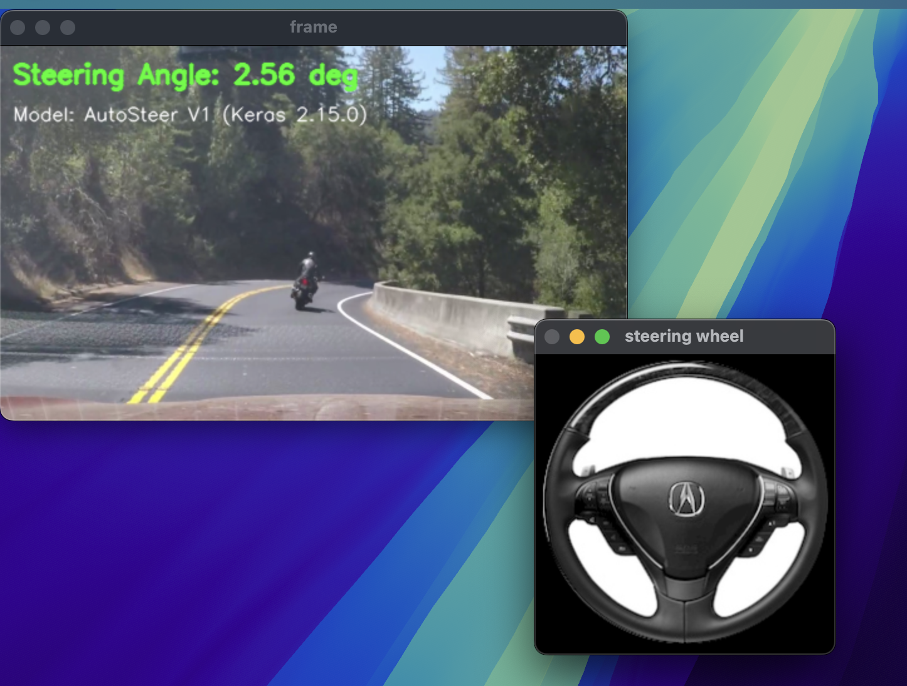
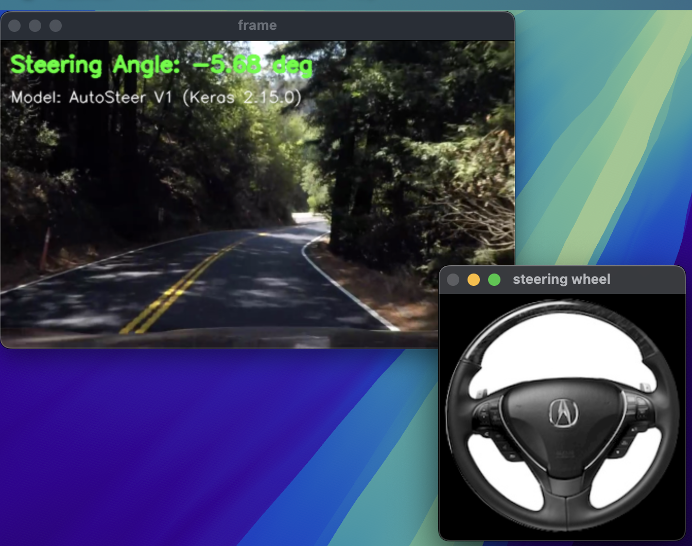

### AutoSteer 
AutoSteer leverages computer vision and Convolutional Neural Networks (CNNs) to predict high-precision steering angles for autonomous vehicles. This project aims to enhance road safety and driving efficiency through advanced AI technology.

### Dataset 
You can get the dataset at [here](https://d17h27t6h515a5.cloudfront.net/topher/2016/December/584f6edd_data/data.zip)

### Code Requirements 
- **Python 3.10** (Required for legacy Keras compatibility).
- Core dependencies: `numpy`, `matplotlib`, `opencv-python`, `keras==2.15.0`, `tensorflow==2.15.0`, `h5py`, `scikit-learn`

Set up the environment using:
```bash
python3.10 -m venv venv_py310
source venv_py310/bin/activate
pip install -r requirements.txt
```

### Features

**Version 1 (Autopilot)**:
- Fast, lightweight Convolutional Neural Network (CNN).
- Processes 40x40 pixel images.
- Ideal for quick training and inference on lower-spec hardware.
- Generates numerical steering angle predictions and provides a real-time visual steering wheel overlay.
  
**Version 2 (Autopilot_V2)**:
- Deeper, more complex CNN designed for robust generalization across different road conditions.
- Processes higher resolution 100x100 pixel images to capture finer lane details and curves.
- Enhanced visual application that overlays both the steering wheel graphic and exact angle text right onto the dashcam feed.

### Setup 

**For Version 1 (Fast & Simple - 40x40):**
1) Run `python Autopilot/LoadData.py` to extract features.
2) Run `python Autopilot/TrainModel.py` to train the `.keras` model.
3) Test using `python Autopilot/DriveApp.py Autopilot/resources/challenge_video.mp4`

**For Version 2 (Complex - 100x100 - Recommended):**
1) Unzip Udacity dataset into `driving_dataset`.
2) Run `python Autopilot_V2/LoadData_V2.py`
3) Train the deeper CNN using `python Autopilot_V2/Train_pilot_V2.py`
4) Run inference with live angle overlay: `python Autopilot_V2/AutopilotApp_V2.py Autopilot/resources/harder_challenge_video.mp4`

### Results

**Day Time Conditions:**


**Dark Light Conditions:**


### Contributors
[Amith Vikram Rajaram](https://github.com/amithvikram10)<br/> 
[B V Rithika](https://github.com/rithikaveeresh)<br/> 
[Abhinav Bhatt](https://github.com/abhi542)<br/> 
